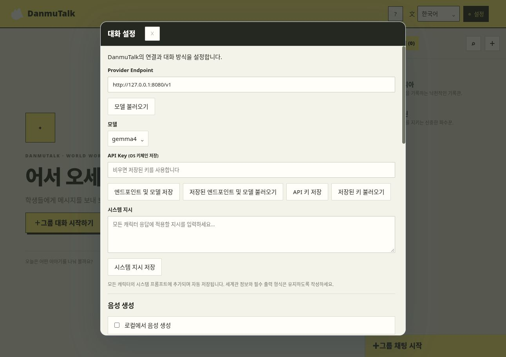
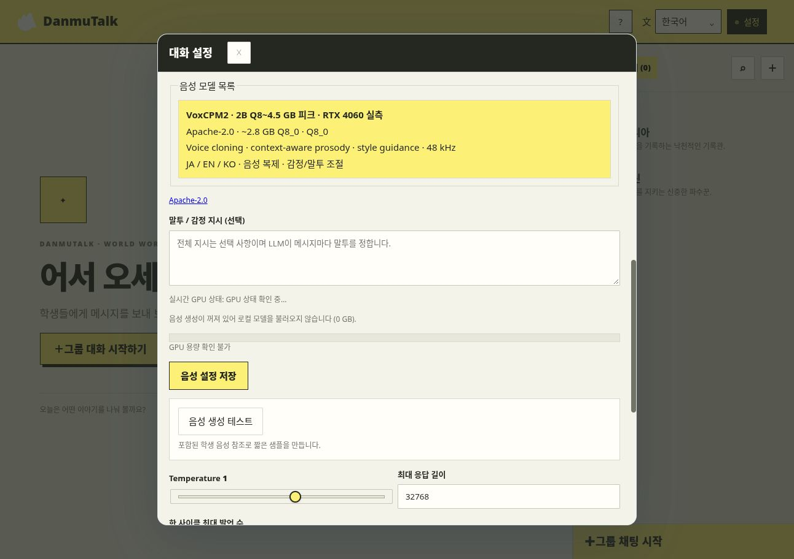

# DanmuTalk

[English](README.md)

> [!WARNING]
> 블루 아카이브 전체 세계관 패키지는 다운로드로 제공하지 않습니다. 넥슨 게임 자료와 Fandom 위키 텍스트가 별도의 권리 및 라이선스 조건에 따라 함께 들어 있으며, 패키지 전체의 재배포 권한이 확인되지 않았습니다. 재배포 권한이 있는 자료로 직접 패키지를 만들어 주세요. [세계관 패키지 만들기 안내](#나만의-세계관-패키지-만들기)를 참고하세요.

DanmuTalk은 세계관 패키지를 불러와 OpenAI 호환 모델과 대화하는 로컬 우선 캐릭터 채팅 앱입니다. 대화와 인증 정보는 사용자의 기기에 저장됩니다.

## 주요 기능

- **스토리 시점 기반 대화** — 대화를 시작하기 전에 시점을 선택해 캐릭터의 맥락을 맞춥니다.
- **1:1 및 그룹 채팅** — 학생 한 명과 대화하거나 여러 학생이 함께하는 대화를 만들 수 있습니다.
- **원하는 모델 엔드포인트 사용** — 앱에서 OpenAI 호환 제공자, 모델, API 키를 설정합니다.
- **선택형 음성 생성** — 로컬 VoxCPM2 음성 합성을 켤 수 있으며, 음성 설정 없이 텍스트로 대화할 수도 있습니다.
- **별도 세계관 패키지** — `.😭` 또는 `.zip` 패키지를 따로 불러와 설치 용량을 줄이고 원하는 콘텐츠를 선택할 수 있습니다.
- **한국어 및 영어 UI** — 세계관 패키지는 그대로 두고 앱 인터페이스 언어를 바꿀 수 있습니다.
- **기기 내 저장** — 대화 기록과 인증 정보는 사용자의 기기에 저장됩니다.

## 스크린샷

아래 이미지는 가상의 **Echo World** 데모와 대체용 삽화를 사용합니다. 대화 응답은 로컬 모의 제공자가 만들었으며, 블루 아카이브 삽화나 음성 녹음은 포함하지 않습니다. 음성 화면은 선택형 TTS 설정을 보여 주며, 생성된 음성 샘플은 아닙니다.

**캐릭터 목록**


**모델 선택**


**대화 및 음성 설정**



**로컬 TTS 옵션**



**시점 선택**


**그룹 대화 설정**


**1:1 대화**


**그룹 대화**


## 가장 쉬운 설치 방법

Python은 필요하지 않습니다. 설치 프로그램이 Node.js 22와 pnpm이 없으면 앱 폴더 안에 내려받고, 체크섬을 확인한 뒤 앱을 빌드합니다. 관리자 권한도 필요하지 않습니다.

### macOS / Linux

터미널을 열고 붙여 넣으세요.

```sh
curl -fsSL https://raw.githubusercontent.com/danmu1ji/danmutalk/main/install.sh | bash
```

설치가 끝나면 `~/DanmuTalk/run.sh`를 실행합니다. 같은 설치 명령을 다시 실행하면 앱을 업데이트하며 `worlds/` 폴더는 유지됩니다.

### Windows

PowerShell에 붙여 넣으세요.

```powershell
irm https://raw.githubusercontent.com/danmu1ji/danmutalk/main/install.ps1 | iex
```

설치가 끝나면 `%USERPROFILE%\DanmuTalk\run.ps1`을 실행합니다. 같은 명령으로 업데이트할 수 있습니다.

## 세계관 패키지 추가하기

세계관 패키지는 앱에 포함되지 않습니다. 받은 `.😭` 또는 `.zip` 파일을 설치 폴더의 `worlds/` 안에 넣고, 앱에서 **패키지 열기**를 눌러 선택하세요. 파일을 앱 창에 바로 끌어다 놓아도 됩니다. 자세한 내용은 [worlds/README.txt](worlds/README.txt)를 참고하세요.

시작용 패키지가 필요하면 [저작권 자료를 제거한 세계관 패키지 템플릿](worlds/import-samples/world-package-template.😭)을 받거나 [폴더 구조](worlds/import-samples/world-package-template/)를 확인하세요. 가상의 예시 데이터, 대체 이미지, 무음 오디오만 들어 있으며, 블루 아카이브 플레이용 패키지가 아니라 구조 참고용입니다.

## 모델 설정

앱에서 **LLM 설정**을 열어 OpenAI 호환 엔드포인트, 모델 이름, API 키를 입력합니다. TTS는 설정에서 선택할 수 있으며, 음성 모델은 처음 사용할 때 준비됩니다.

## 개발용 실행

이미 Node.js 22 이상과 pnpm 9가 설치되어 있다면 저장소에서 `./run.sh`(macOS/Linux) 또는 `./run.ps1`(Windows)을 실행하세요. 개발 환경을 설치하는 Python TUI는 `python tools/install.py`입니다.

## 라이선스 및 외부 프로젝트

사용한 TTS, CrispASR, 앱 라이브러리, 글꼴과 세계관 설명의 출처 및 라이선스 요약은 [NOTICE.md](NOTICE.md)에 있습니다.

## 나만의 세계관 패키지 만들기

[`worlds/import-samples/world-package-template/`](worlds/import-samples/world-package-template/) 폴더를 복사해 시작할 수 있습니다. YAML은 실제 패키지의 필드 배치, 중첩 구조, 값 유형을 유지하고, 엔티티 및 미디어 종류마다 가상의 예시 하나만 포함합니다. 예시 ID와 참조, Markdown, 무음 미디어를 직접 만들었거나 사용할 권한이 있는 자료로 교체하세요. 준비된 [`.😭` 템플릿 파일](worlds/import-samples/world-package-template.😭)은 앱에서 바로 열어 볼 수도 있습니다.

더 작은 패키지는 Markdown 파일을 폴더에 작성하는 방법으로 만들 수 있습니다. 각 `.md` 파일은 하나의 엔티티가 됩니다. 파일 맨 앞의 메타데이터에 종류, 제목, 요약, 태그를 적을 수 있고 `[[이름]]` 문법으로 엔티티를 연결할 수 있습니다.

```text
my-world/
├── characters/
│   └── aria.md
├── locations/
│   └── harbor.md
└── lore/
    └── records.md
```

예를 들어 `characters/aria.md`는 다음처럼 작성할 수 있습니다.

```markdown
---
type: character
title: Aria
summary: 기록을 꼼꼼히 남기는 낙천적인 기록관.
tags: [archivist]
---
# Aria

Aria는 [[Harbor]]에서 일합니다.
```

의존성이 설치된 소스 체크아웃에서 다음 명령으로 패키지를 만드세요.

```sh
pnpm exec tsx tools/importer/cli.ts ./my-world ./my-world.😭 --id my-world --name "My World"
```

임포터가 아래 핵심 파일을 포함한 ZIP 호환 `.😭` 패키지를 만듭니다. Markdown 문서와 미디어는 추가할 수 있습니다. 세부 구조를 직접 구성하려면 전체 예제인 [`worlds/examples/echo-world/`](worlds/examples/echo-world/)를 참고하세요.

```text
my-world.😭
├── manifest.yaml
├── world.yaml
├── index/entities.yaml
├── timeline/
│   ├── time-slices.yaml
│   └── states.yaml
├── assets/media.yaml
├── characters/…
├── lore/…
└── assets/images/…
```
