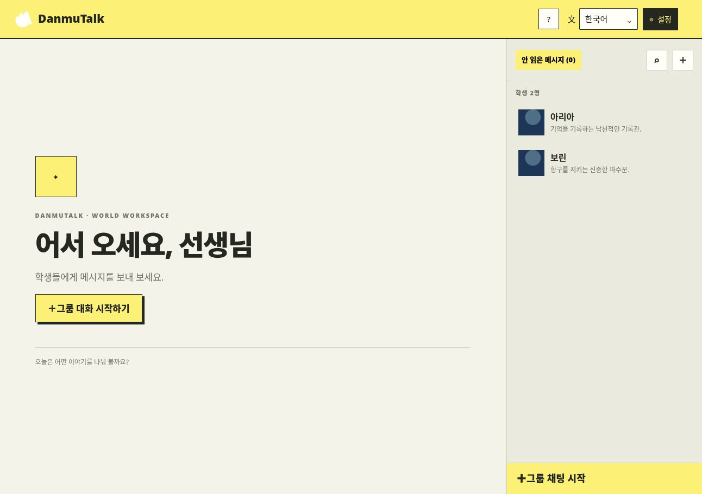
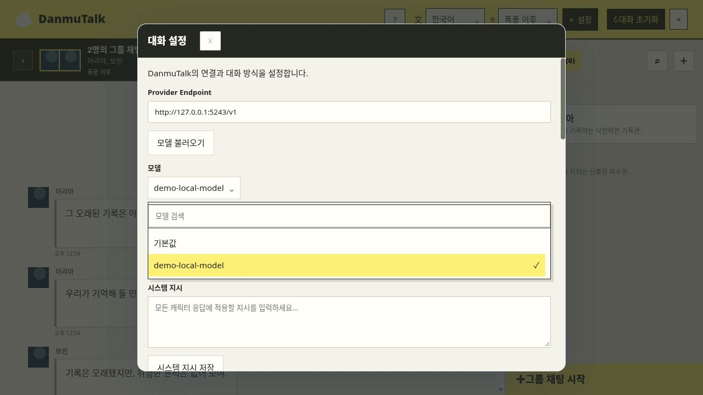
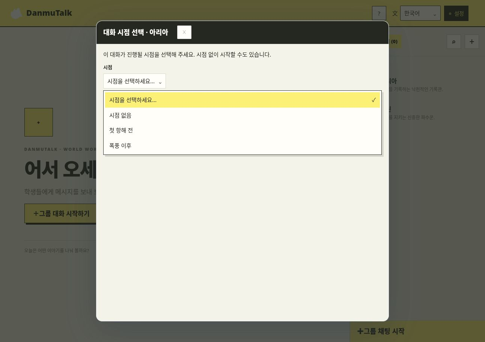
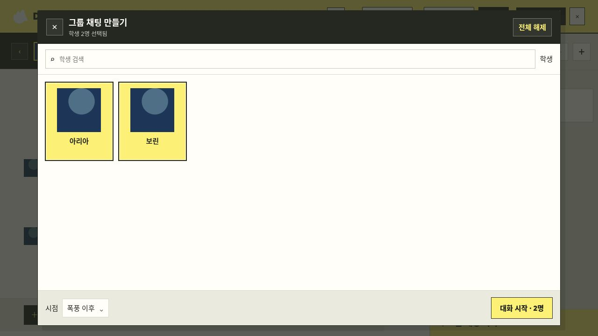
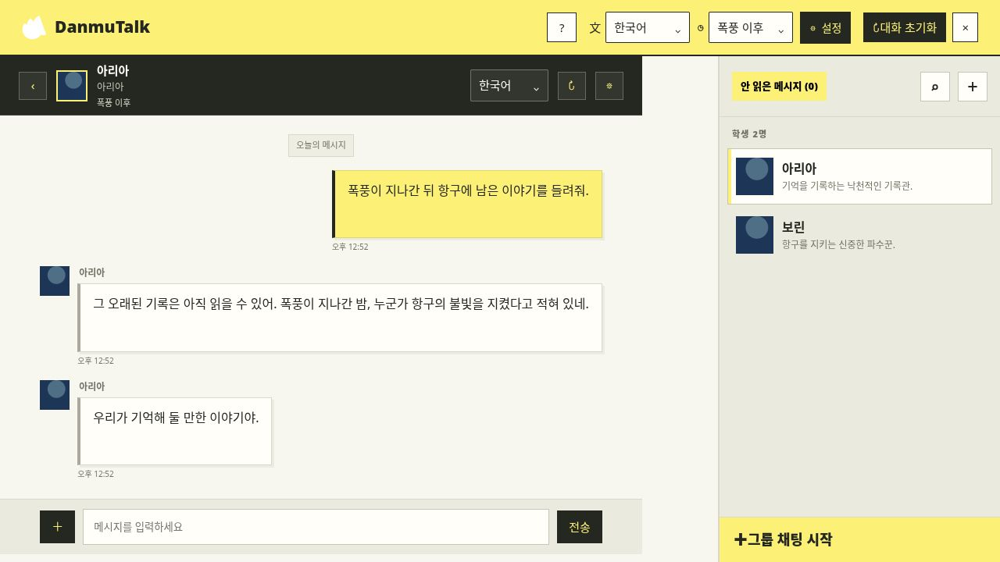
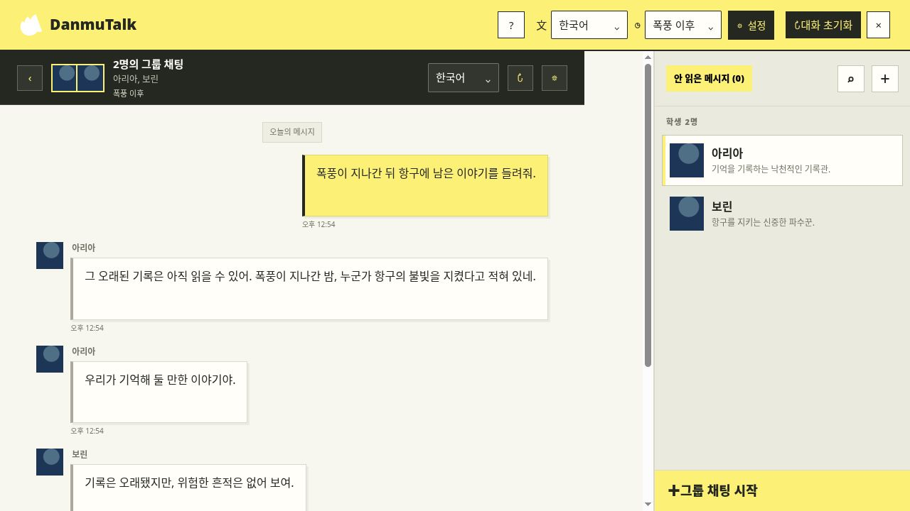

# DanmuTalk

[English README](README.md)

> [!WARNING]
> **패키지 이용 권리:** 저장소에는 커뮤니티 제작 블루 아카이브 세계관 패키지가 포함되어 있습니다. 패키지에 사용된 자료는 각 출처의 이용 조건을 따르므로, 재배포 전에 권한과 출처 표시를 확인하세요. 공유할 수 있는 자료로 만들려면 [세계관 패키지 구조 템플릿](worlds/import-samples/world-package-template/)을 참고하세요.

저장소에는 [블루 아카이브 세계관 패키지](worlds/blue-archive.😭)가 포함되어 있으며, 시작 화면에서 선택할 수 있습니다.

DanmuTalk은 세계관 패키지를 불러와 캐릭터와 대화하는 로컬 우선 앱입니다. `.😭` 또는 `.zip` 파일을 열고 스토리 시점을 선택한 뒤 OpenAI 호환 모델 엔드포인트로 1:1 또는 그룹 대화를 할 수 있습니다. 대화 기록과 인증 정보는 사용자의 기기에 저장됩니다.

## 주요 기능

- **1:1 및 그룹 대화** — 캐릭터 한 명과 대화하거나 여러 명이 참여하는 방을 만듭니다.
- **시작 시 세계관 선택** — `worlds/` 폴더의 패키지를 시작 화면에서 선택하거나 파일을 열고 끌어다 놓을 수 있습니다.
- **스토리 시점 기반 맥락** — 대화를 시작하기 전에 원하는 시점을 선택합니다.
- **원하는 모델 사용** — OpenAI 호환 엔드포인트, 모델, 시스템 지시를 설정합니다.
- **한국어 및 영어 UI** — 패키지 콘텐츠와 별도로 인터페이스 언어를 바꿉니다.
- **로컬 LLM 설정 도우미** — 하드웨어를 확인하고 CPU 아키텍처와 사용 가능한 GPU 백엔드에 맞춰 llama.cpp를 소스에서 빌드합니다. 터미널 메뉴는 ↑/↓ 키와 Space 또는 Enter로 조작합니다. Windows에서는 `python tools/local_llm_setup.py`, macOS/Linux에서는 `python3 tools/local_llm_setup.py`를 실행하세요.
- **기기 내 저장** — 대화 기록과 제공자 인증 정보는 사용자의 기기에 저장됩니다.

## 스크린샷

아래 화면은 가상의 **Echo World**와 대체용 삽화를 사용합니다. 대화 응답은 로컬 모의 제공자가 만들었으며, 블루 아카이브 삽화나 녹음은 포함하지 않습니다.

| 캐릭터 목록 | 모델 설정 및 검색 |
|---|---|
|  |  |
| **시점 선택** | **그룹 설정** |
|  |  |
| **1:1 대화** | **그룹 대화** |
|  |  |

## 설치

### Python 설치 프로그램

Python 3.10 이상을 설치한 다음 실행하세요.

```sh
# Windows
py install.py

# macOS / Linux
python3 install.py
```

설치 프로그램은 공개 소스 코드를 내려받고, 필요하면 체크섬을 확인한 Node.js 22와 pnpm을 앱 폴더 안에 설치한 뒤 의존성을 설치하고 앱을 빌드합니다. 설치가 끝나면 바로 실행할 수 있습니다. 설치 폴더에서 `python run.py`를 실행하세요. 업데이트도 `python install.py`를 다시 실행하면 됩니다. 기본 설치 폴더는 `~/DanmuTalk`이며 Windows에서는 `%USERPROFILE%\DanmuTalk`입니다. `MOMOSIM_DIR` 환경 변수로 변경할 수 있습니다.

### 운영체제별 Python 설치

- **Windows:** [python.org](https://www.python.org/downloads/windows/)에서 Python 3.10 이상을 받고 설치 시 “Add Python to PATH”를 선택하세요. `py --version`으로 확인합니다.
- **macOS:** [python.org](https://www.python.org/downloads/macos/) 설치 프로그램을 이용하거나 Homebrew가 있으면 `brew install python`을 실행하세요. `python3 --version`으로 확인합니다.
- **Ubuntu/Debian:** `sudo apt install python3 python3-venv python3-pip`
- **Fedora:** `sudo dnf install python3 python3-pip`
- **Arch Linux:** `sudo pacman -S python python-pip`
- **openSUSE:** `sudo zypper install python3 python3-pip`
- **Alpine Linux:** `sudo apk add python3 py3-pip`

Python 추가 라이브러리는 필요하지 않습니다. 설치 도구와 모델 도우미는 표준 라이브러리만 사용합니다. 도구 호환을 위해 `requirements.txt`도 제공합니다.

로컬 LLM 도우미로 llama.cpp를 빌드하려면 CMake와 운영체제의 C/C++ 컴파일러가 추가로 필요합니다. CUDA와 HIP 가속은 각각의 도구 모음이 있어야 하며, macOS에서는 Metal 빌드를 활성화합니다.

## 세계관 패키지 추가

`.😭` 또는 `.zip` 파일을 설치 폴더의 `worlds/` 안에 넣으세요. 앱을 열면 해당 패키지가 세계관 선택 화면에 표시됩니다. 같은 설치본을 사용하는 사람들도 `worlds/`에 패키지를 넣어 공유할 수 있습니다. 다른 위치의 패키지는 **패키지 열기**를 누르거나 창에 끌어다 놓으세요. 자세한 내용은 [worlds/README.txt](worlds/README.txt)를 참고하세요.

[템플릿 압축 파일](worlds/import-samples/world-package-template.😭)에는 가상의 예시와 대체 삽화만 있습니다. [템플릿 폴더](worlds/import-samples/world-package-template/)를 복사해 직접 만든 세계를 구성할 수 있습니다. 게임 삽화와 오디오는 포함하지 않습니다. [자원봉사 삽화 제출](https://forms.gle/UnhotZ14Xp66HR4F7) 또는 [미디어 기여자](docs/media-contributors.md)에서 작가 표기를 확인하세요.

## 기여하기

아이디어, 버그 제보, 개선 제안을 환영합니다. 변경 사항을 논의하거나 문제를 알리려면 [이슈를 등록](https://github.com/danmu1ji/danmutalk/issues)해 주세요. 풀 리퀘스트도 자유롭게 보내실 수 있습니다. 세계관 패키지나 삽화를 제안할 때는 공유할 권리가 있는 자료인지 확인하고 필요한 출처를 함께 표시해 주세요.

## 소스에서 실행

Python 3.10 이상이 필요합니다. Windows에서는 `py run.py --prepare`, macOS/Linux에서는 `python3 run.py --prepare`로 Node.js/pnpm 및 앱 빌드를 준비하세요. `py run.py` 또는 `python3 run.py`로 실행합니다. Vite 개발 서버는 뒤에 `--dev`를 붙이세요. 로컬 모델 설정 도우미는 `py tools/local_llm_setup.py` 또는 `python3 tools/local_llm_setup.py`입니다.

## 라이선스

DanmuTalk의 원본 애플리케이션 코드와 보조 도구는 [MIT 라이선스](LICENSE)를 따릅니다. 세계관 패키지, 글꼴, 외부 구성 요소, 기여 미디어에는 각각 별도 조건이 적용됩니다. [NOTICE.md](NOTICE.md)와 [미디어 기여자](docs/media-contributors.md)를 확인하세요. 블루 아카이브 게임 삽화, 녹음, 음성 참조 파일은 포함하지 않습니다.

### 사용한 외부 프로젝트

- 로컬 GGUF 모델 실행에는 [llama.cpp](https://github.com/ggml-org/llama.cpp)를 사용할 수 있습니다. 도우미는 CMake로 현재 CPU 아키텍처에 맞게 소스 빌드하고, 해당 도구 모음이 있으면 Metal, CUDA 또는 HIP을 활성화합니다. llama.cpp의 [공식 빌드 안내](https://github.com/ggml-org/llama.cpp/blob/master/docs/build.md)를 참고하세요.
- 앱은 [Tauri](https://github.com/tauri-apps/tauri), [React](https://github.com/facebook/react), [fflate](https://github.com/101arrowz/fflate), [eemeli/yaml](https://github.com/eemeli/yaml) 및 [NOTICE.md](NOTICE.md)에 기록된 Rust 크레이트를 사용합니다.
- 포함된 글꼴은 [Noto Sans](https://fonts.google.com/noto/specimen/Noto+Sans) (SIL OFL 1.1)와 경기천년제목이며, 자세한 내용은 `apps/desktop/public/fonts/`의 고지를 확인하세요.

## 나만의 세계관 패키지 만들기

[`worlds/import-samples/world-package-template/`](worlds/import-samples/world-package-template/)를 복사해 시작하세요. YAML은 실제 패키지의 필드 배치와 값 구조를 보여 주며, 각 항목에는 가상의 예시 하나가 있습니다. 샘플 ID와 참조, Markdown을 직접 만들었거나 사용할 권한이 있는 자료로 바꾸세요. 준비된 [`.😭` 템플릿 파일](worlds/import-samples/world-package-template.😭)은 앱에서 바로 열 수 있습니다.

각 Markdown 파일은 엔티티 하나를 만듭니다. 앞부분에 종류, 제목, 요약, 태그를 적고 `[[이름]]` 문법으로 서로 연결할 수 있습니다.

```text
my-world/
├── characters/aria.md
├── locations/harbor.md
└── lore/records.md
```

패키지를 생성하려면 의존성이 설치된 환경에서 실행합니다.

```sh
pnpm exec tsx tools/importer/cli.ts ./my-world ./my-world.😭 --id my-world --name "My World"
```

임포터는 ZIP 호환 `.😭` 파일을 만듭니다. 예시 폴더 [`worlds/examples/echo-world/`](worlds/examples/echo-world/)에서 전체 구조를 확인하세요.
